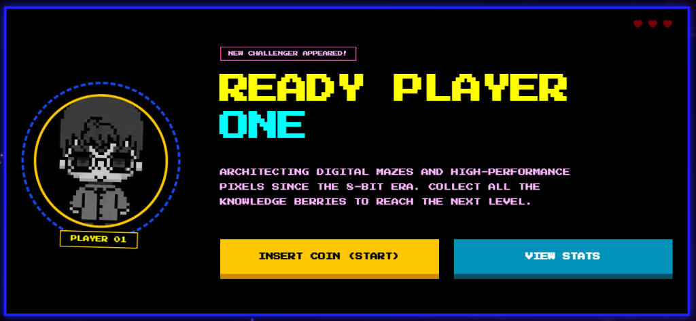

  
   
  

  

  

 

---

  <h3><code>== CHARACTER PROFILE ==</code></h3>
  

    <code><b>NAME</b>: GERIC MORIT</code> 
    <code><b>ROLE</b>: INFORMATION TECHNOLOGY STUDENT @ TUP - TAGUIG</code> 
    <code><b>QUEST</b>: MASTERING REACT NATIVE & TYPESCRIPT</code> 
    <code><b>ACHIEVEMENT</b>: PROFESSIONAL BUG CREATOR SINCE 2022</code>
  

---

  <h3><code>== TECH ARSENAL ==</code></h3>
  

    
  

---

  <h3><code>== HIGH SCORES & STATS ==</code></h3>
   
  
  
   
  

---

  <h3><code>== CONNECT (MULTIPLAYER) ==</code></h3>
  

    
    
    
  

 

  <code><b>GAME OVER? NO. CONTINUE? [10]</b></code> 
  <code>LEVEL UP YOUR TEAM BY HIRING PLAYER 01.</code>

